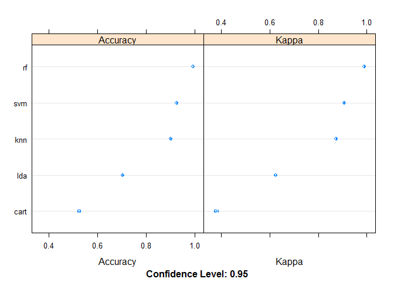

# Human Activity Recognition - Predicting How Well A Barbell Is Lifted
Andrew F Konecny  
March 11, 2017  


## 1. Executvie Summary / Synopsis ##
There are many modern devices emerging to measure different forms of human activity.  Typically enthusiasts want to measure how much activity they have done.  The challenge here is to measure how well an activity has been done.  The subject is weight lifting barbells.  By following an analytical approach to model building taught in the John's Hopkins University Practical Machine Language course, a model will in the end be selected that is 99.7% accurate and correctly predicted 20 use case outcomes.

Note: I have left the run more verbose than report style so that peers can see the Analytics Pipeline / Reproducible Research method I have followed for this Practical Machine Learning Final Project.  I have done my best to clearly outline where I answer the final project requirements.  


```r
# Load libraries
library(dplyr)
```

```
## 
## Attaching package: 'dplyr'
```

```
## The following objects are masked from 'package:stats':
## 
##     filter, lag
```

```
## The following objects are masked from 'package:base':
## 
##     intersect, setdiff, setequal, union
```

```r
library(caret)
```

```
## Loading required package: lattice
```

```
## Loading required package: ggplot2
```

```r
library(rpart)
library(e1071)
library(parallel)
library(doParallel)
```

```
## Loading required package: foreach
```

```
## Loading required package: iterators
```

## 2. Data Processing ###

```r
# Load har data set
harURL <- "https://d396qusza40orc.cloudfront.net/predmachlearn/pml-training.csv"
# When importing data, empty values are also NA
har = read.csv(harURL, na.string=c("NA","NaN","#DIV/0!",""), header=TRUE)
dim(har) # Track rows and columns
```

```
## [1] 19622   160
```

```r
# I have turned this off - takes up alot of realestate
# This report showed the the count of missing data by variable
#har %>% summarise_each(funs(sum(is.na(.))))

# load quiz data set
quizURL <- "https://d396qusza40orc.cloudfront.net/predmachlearn/pml-testing.csv"
quiz = read.csv(quizURL, na.string=c("NA","NaN","#DIV/0!",""), header=TRUE)
dim(quiz) # Track rows and columns
```

```
## [1]  20 160
```

The first step in model building is to correctly load the data.  Based on the references provided I appear to have the correct number of rows (observations) and columns (variables) for each loaded data set.  


```r
# The first 7 variables do not look like useful predictors
har <- har[,-c(1:7)]
dim(har) # Track rows and columns
```

```
## [1] 19622   153
```

```r
# Early exploration of data shows a number of columns are almost completely NA. Keep columns that don't have missing data
har <- har[, sapply(har, Negate(anyNA)), drop = FALSE]
dim(har) # Track rows and columns
```

```
## [1] 19622    53
```

The next step in model building is to assess the variables to identify possible predictors. In earlier iterations of this script I did more data exploration to better understand the variables.  X, User_name, timestamps and windows did not appear to be useful for prediction.  I then assessed the quality of each remaining variable (i.e. frequency of valid responses for each variable).  There were a series of variables with at least 98% no observations so I decided to drop them all as potential predictors.  In this case there did not appear to be outliers to deal with and it did not make sense to impute missing data.


```r
# Create training and testing data sets
# Splits seem to vary 70 / 30, 75 / 25, 80 / 20
inTrain = createDataPartition(har$classe, p = 0.70)[[1]]
training = har[inTrain,]
testing = har[-inTrain,]

dim(training) # Track rows and columns
```

```
## [1] 13737    53
```

```r
dim(testing) # Track rows and columns
```

```
## [1] 5885   53
```

The first assumption I am making is the data entitled training is actually the human activity recognition (HAR) data set. This means to build and validate a model I will create training (70%) and testing (30%) data sets from it.  The second assumption I am making is the data entitiled testing is actually 20 observations where the predcitions will be evaluated to compute a quiz score.  I am not comfortable that a data set with 20 observations is useful to test / validate the final model I choose.  

## 3. Results ##
### 3.1 Build Models ###

How you built your model:  
1. Load the data correctly.  
1. Assess data to identify possible predictors.  
1. Assess the quality of remaining varaibles.  
1. Create training and testing data sets for model building.  
1. Set seeds for reproducibility.  
1. Build several different types of models.  
1. Enable parallel processing to speed up model runs.  
1. Because model runs can take a long time, save model results so don't have to re-run as iteratively improve script and model building.  
1. Use caret to more easily manage and run many different models.  
1. 10 k-fold and 10 repeats for repeated cross-validation in training.  
1. Compare the model results based on Accuracy and select the "best" model.  


```r
# Set working directory for saving or loading model files
setwd("C:/Users/konecnya/coursera/pml/practicalmachinelearning/models")

# Configure parallel processing
cluster <- makeCluster(detectCores() - 1) # convention to leave 1 core for OS
registerDoParallel(cluster)

# Configure trainControl object
control <- trainControl(method = "repeatedcv", number = 10, repeats = 10, allowParallel = TRUE)
metric <- "Accuracy"

# Develop training models OFF
# a) linear algorithms
# lda
#set.seed(666)
#fit.lda <- train(classe ~ ., data = training, method = "lda", metric = metric, trControl = control, importance=TRUE)
#save(fit.lda, file="lda.Rdata")
# b) nonlinear algorithms
# CART
#set.seed(666)
#fit.cart <- train(classe ~ ., data = training, method = "rpart", metric = metric, trControl = control)
#save(fit.cart, file="cart.Rdata")
# kNN
#set.seed(666)
#fit.knn <- train(classe ~ ., data = training, method = "knn", metric = metric, trControl = control)
#save(fit.knn, file="knn.Rdata")
# c) advanced algorithms
# SVM - On my platform aproximately 5 hours
#set.seed(666)
#fit.svm <- train(classe ~ ., data = training, method = "svmRadial", metric = metric, trControl = control, importance=TRUE)
#save(fit.svm, file="svm.Rdata")
# Random Forest - On my platform approximately 17 hours
#set.seed(666)
#fit.rf <- train(classe ~ ., data = training, method = "rf", metric = metric, trControl = control, importance=TRUE)
#save(fit.rf, file="rf.Rdata")

# De-register parallel processing cluster
stopCluster(cluster)
registerDoSEQ()
```


```r
# Set working directory for saving or loading model files
setwd("C:/Users/konecnya/coursera/pml/practicalmachinelearning/models")

# Load previous model results ON
load(file = "lda.RData")
fit.lda
```

```
## Linear Discriminant Analysis 
## 
## 13737 samples
##    52 predictor
##     5 classes: 'A', 'B', 'C', 'D', 'E' 
## 
## No pre-processing
## Resampling: Cross-Validated (10 fold, repeated 10 times) 
## Summary of sample sizes: 12365, 12364, 12362, 12363, 12363, 12363, ... 
## Resampling results:
## 
##   Accuracy   Kappa    
##   0.7028483  0.6240286
## 
## 
```

```r
load(file = "cart.RData")
fit.cart
```

```
## CART 
## 
## 13737 samples
##    52 predictor
##     5 classes: 'A', 'B', 'C', 'D', 'E' 
## 
## No pre-processing
## Resampling: Cross-Validated (10 fold, repeated 10 times) 
## Summary of sample sizes: 12365, 12364, 12362, 12363, 12363, 12363, ... 
## Resampling results across tuning parameters:
## 
##   cp          Accuracy   Kappa     
##   0.03092259  0.5232954  0.37946134
##   0.06086190  0.4109698  0.20007042
##   0.11667175  0.3263172  0.06398664
## 
## Accuracy was used to select the optimal model using  the largest value.
## The final value used for the model was cp = 0.03092259.
```

```r
load(file = "knn.RData")
fit.knn
```

```
## k-Nearest Neighbors 
## 
## 13737 samples
##    52 predictor
##     5 classes: 'A', 'B', 'C', 'D', 'E' 
## 
## No pre-processing
## Resampling: Cross-Validated (10 fold, repeated 10 times) 
## Summary of sample sizes: 12365, 12364, 12362, 12363, 12363, 12363, ... 
## Resampling results across tuning parameters:
## 
##   k  Accuracy   Kappa    
##   5  0.9007934  0.8744717
##   7  0.8785916  0.8463301
##   9  0.8599629  0.8227166
## 
## Accuracy was used to select the optimal model using  the largest value.
## The final value used for the model was k = 5.
```

```r
load(file = "svm.RData")
fit.svm
```

```
## Support Vector Machines with Radial Basis Function Kernel 
## 
## 13737 samples
##    52 predictor
##     5 classes: 'A', 'B', 'C', 'D', 'E' 
## 
## No pre-processing
## Resampling: Cross-Validated (10 fold, repeated 10 times) 
## Summary of sample sizes: 12365, 12364, 12362, 12363, 12363, 12363, ... 
## Resampling results across tuning parameters:
## 
##   C     Accuracy   Kappa    
##   0.25  0.8690542  0.8340121
##   0.50  0.9004221  0.8737474
##   1.00  0.9258720  0.9060547
## 
## Tuning parameter 'sigma' was held constant at a value of 0.01259729
## Accuracy was used to select the optimal model using  the largest value.
## The final values used for the model were sigma = 0.01259729 and C = 1.
```

```r
load(file = "rf.RData")
fit.rf
```

```
## Random Forest 
## 
## 13737 samples
##    52 predictor
##     5 classes: 'A', 'B', 'C', 'D', 'E' 
## 
## No pre-processing
## Resampling: Cross-Validated (10 fold, repeated 10 times) 
## Summary of sample sizes: 12365, 12364, 12362, 12363, 12363, 12363, ... 
## Resampling results across tuning parameters:
## 
##   mtry  Accuracy   Kappa    
##    2    0.9919998  0.9898793
##   27    0.9913519  0.9890599
##   52    0.9862344  0.9825848
## 
## Accuracy was used to select the optimal model using  the largest value.
## The final value used for the model was mtry = 2.
```

The "Analytics Pipleline" and "Reproducible Research"" principles taught in the John's Hopkins University Data Science Certification has demonstrated that it is an iterative process.  Model building is computationally intensive.  Rather than re-build models each time this analytical script is run for improvement, I decided to save models once satisfied with their best results.

### 3. Accuracy ###
Why you made the choices you did.  

The first choice was to break the training data set into a training and testing data set.  The second choice was to craft and compare a number of different models using caret.  The third choice was to use tuning parameters for k-fold / cv to leverage cross validation in caret.  The fourth choice was to compare the accuracy of the different models, a summary table and plot.  The final choice was to choose the "best" model which turned out to be crafted by leveraging Random Forest with an accuracy of 99.7%.  This was confirmed by correctly predicting all 20 quiz test cases.  

How you used cross validation.  
I used k-fold / cv (repeatedcv) within caret.  By doing 10 repeats of 10 (9 samples and 1 test).

The information that follows shows the logic in selecting the Random Forest "best model".  I also for the Random Forest model show the relative importance of the predictors.  


```r
# Summarize accuracy of models
results <- resamples(list(lda=fit.lda, cart=fit.cart, knn=fit.knn, svm=fit.svm, rf=fit.rf))
summary(results)
```

```
## 
## Call:
## summary.resamples(object = results)
## 
## Models: lda, cart, knn, svm, rf 
## Number of resamples: 100 
## 
## Accuracy 
##        Min. 1st Qu. Median   Mean 3rd Qu.   Max. NA's
## lda  0.6708  0.6926 0.7037 0.7028  0.7120 0.7354    0
## cart 0.3707  0.5090 0.5211 0.5233  0.5358 0.5946    0
## knn  0.8820  0.8952 0.9009 0.9008  0.9061 0.9177    0
## svm  0.9089  0.9214 0.9269 0.9259  0.9302 0.9424    0
## rf   0.9854  0.9898 0.9924 0.9920  0.9936 0.9971    0
## 
## Kappa 
##        Min. 1st Qu. Median   Mean 3rd Qu.   Max. NA's
## lda  0.5843  0.6112 0.6250 0.6240  0.6358 0.6656    0
## cart 0.1319  0.3596 0.3756 0.3795  0.3983 0.4909    0
## knn  0.8508  0.8673 0.8746 0.8745  0.8813 0.8959    0
## svm  0.8845  0.9004 0.9073 0.9061  0.9115 0.9270    0
## rf   0.9816  0.9871 0.9903 0.9899  0.9919 0.9963    0
```


```r
# Compare accuracy of models
dotplot(results)
```

<!-- -->


```r
# Summarize Best Model
summary(fit.rf$finalModel)
```

```
##                 Length Class      Mode     
## call                5  -none-     call     
## type                1  -none-     character
## predicted       13737  factor     numeric  
## err.rate         3000  -none-     numeric  
## confusion          30  -none-     numeric  
## votes           68685  matrix     numeric  
## oob.times       13737  -none-     numeric  
## classes             5  -none-     character
## importance        364  -none-     numeric  
## importanceSD      312  -none-     numeric  
## localImportance     0  -none-     NULL     
## proximity           0  -none-     NULL     
## ntree               1  -none-     numeric  
## mtry                1  -none-     numeric  
## forest             14  -none-     list     
## y               13737  factor     numeric  
## test                0  -none-     NULL     
## inbag               0  -none-     NULL     
## xNames             52  -none-     character
## problemType         1  -none-     character
## tuneValue           1  data.frame list     
## obsLevels           5  -none-     character
```

```r
predictions <- predict(fit.rf, training)
tcm <- confusionMatrix(predictions, training$classe)
tcm
```

```
## Confusion Matrix and Statistics
## 
##           Reference
## Prediction    A    B    C    D    E
##          A 3905    3    0    0    0
##          B    0 2655    4    0    0
##          C    0    0 2392   17    0
##          D    0    0    0 2235    3
##          E    1    0    0    0 2522
## 
## Overall Statistics
##                                           
##                Accuracy : 0.998           
##                  95% CI : (0.9971, 0.9986)
##     No Information Rate : 0.2843          
##     P-Value [Acc > NIR] : < 2.2e-16       
##                                           
##                   Kappa : 0.9974          
##  Mcnemar's Test P-Value : NA              
## 
## Statistics by Class:
## 
##                      Class: A Class: B Class: C Class: D Class: E
## Sensitivity            0.9997   0.9989   0.9983   0.9925   0.9988
## Specificity            0.9997   0.9996   0.9985   0.9997   0.9999
## Pos Pred Value         0.9992   0.9985   0.9929   0.9987   0.9996
## Neg Pred Value         0.9999   0.9997   0.9996   0.9985   0.9997
## Prevalence             0.2843   0.1935   0.1744   0.1639   0.1838
## Detection Rate         0.2843   0.1933   0.1741   0.1627   0.1836
## Detection Prevalence   0.2845   0.1936   0.1754   0.1629   0.1837
## Balanced Accuracy      0.9997   0.9993   0.9984   0.9961   0.9994
```

```r
#importance(fit.rf$finalModel) # Table very large
varImpPlot(fit.rf$finalModel)
```

<!-- -->


```r
# estimate skill of rf on the validation dataset
predictions <- predict(fit.rf, testing)
vcm <- confusionMatrix(predictions, testing$classe)
vcm
```

```
## Confusion Matrix and Statistics
## 
##           Reference
## Prediction    A    B    C    D    E
##          A 1674    0    0    0    0
##          B    0 1139    2    0    0
##          C    0    0 1024    8    0
##          D    0    0    0  955    0
##          E    0    0    0    1 1082
## 
## Overall Statistics
##                                           
##                Accuracy : 0.9981          
##                  95% CI : (0.9967, 0.9991)
##     No Information Rate : 0.2845          
##     P-Value [Acc > NIR] : < 2.2e-16       
##                                           
##                   Kappa : 0.9976          
##  Mcnemar's Test P-Value : NA              
## 
## Statistics by Class:
## 
##                      Class: A Class: B Class: C Class: D Class: E
## Sensitivity            1.0000   1.0000   0.9981   0.9907   1.0000
## Specificity            1.0000   0.9996   0.9984   1.0000   0.9998
## Pos Pred Value         1.0000   0.9982   0.9922   1.0000   0.9991
## Neg Pred Value         1.0000   1.0000   0.9996   0.9982   1.0000
## Prevalence             0.2845   0.1935   0.1743   0.1638   0.1839
## Detection Rate         0.2845   0.1935   0.1740   0.1623   0.1839
## Detection Prevalence   0.2845   0.1939   0.1754   0.1623   0.1840
## Balanced Accuracy      1.0000   0.9998   0.9982   0.9953   0.9999
```

### 3. Sample Error ###
What you think the expected out of sample error is.  


```r
# Out-of-sample error
ose <- round((1 - vcm$overall[1])*100, digits = 2)
```

The out of sample error is 0.19 percent.

In Sample Error: "The error rate you get on the same data set you used to build your predictor.  Sometimes called resubstitution error."

Out of Sample Error: "The error rate you get on a new data set.  Sometimes called generalization error."

Focus is out of sample error.  In sample error < out of sample error (due to overfitting - matching your algorithm to the data you have). Data have two parts: i) Signal and ii) Noise. Goal of a predictor is to find signal. If "perfect" in-sample predictor then capture signal + noise for that data.  Predictor will not performa as well on new samples.

### 3. Prediction ###
Use a prediction model to predict 20 different test cases. 


```r
# Create quiz prediction set
as.data.frame(predict(fit.rf, quiz))
```

```
##    predict(fit.rf, quiz)
## 1                      B
## 2                      A
## 3                      B
## 4                      A
## 5                      A
## 6                      E
## 7                      D
## 8                      B
## 9                      A
## 10                     A
## 11                     B
## 12                     C
## 13                     B
## 14                     A
## 15                     E
## 16                     E
## 17                     A
## 18                     B
## 19                     B
## 20                     B
```

## Conclusion  ##
By loading the data correctly, choosing a sensible group of possible predictors, creating a training and test set, leveraging caret with k-fold cross validation and comparing several possible modeling frameworks, I used the prediction model with the best accuracy, Random Forest - 99.7%, and I was able to correctly predict the outcome for 20 out of 20 test cases - 100%.

## 4. Appendix ##

### 4.1 Assignment ###
Submit a report describing:  
1. How you built your model.  
1. How you used cross validation.  
1. What you think the expected out of sample error is.  
1. Why you made the choices you did.  
1. Use prediction model to predict 20 different test cases. 

Github repo with R markdown and compiled HTML file describing your analysis  
writeup < 2000 words  
figures < 5  
Easier if submit a repo with a gh-pages branch so the HTML page can be viewed online  

References:  
https://www.coursera.org/learn/practical-machine-learning/peer/R43St/prediction-assignment-writeup  
https://github.com/lgreski/datasciencectacontent/blob/master/markdown/pml-ghPagesSetup.md  

### 4.2 Model Building Steps ###
1. Question  
1. Input Data  
1. Features  
1. Algorithm  
1. Parameters  
1. Evaluation  

### 4.3 Background ###
Devices capture personal activity data (human activity recognition), typically how much they do something but not how well. 6 participants (male 20-28) were asked to perform barbell lifts correct and incorrect, 5 different ways (of 10 repetitions). Accelerometers on the belt, forearm, arm and dumbell took measurements.  

Class:  
A - exact specification  
B - throw elbows to the front  
C - lifting the dumbbell only halfway  
D - lowering the dumbbell only halfway  
E - throwing the hips to the front 

Source: http://groupware.les.inf.puc-rio.br/har  
